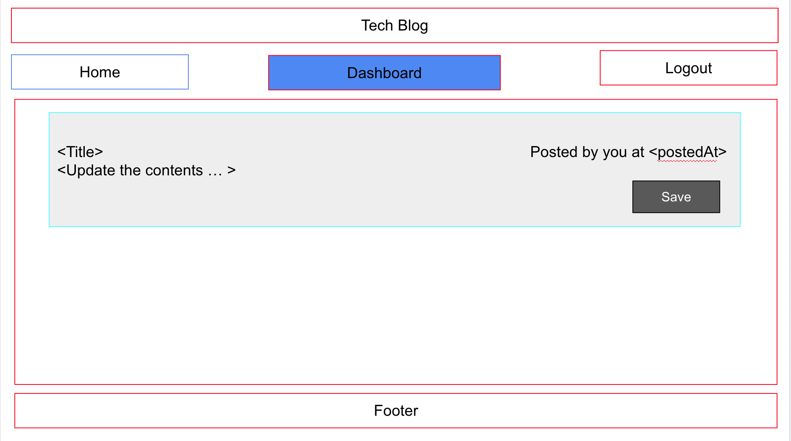

# Tech-Blog


## Table Of Contents
* [Description](#description)
* [Wireframe](#wireframe)
* [Installation](#installation)
* [Usage](#usage)
* [Technologies](#technologies)
* [License](#license)
* [Author Links](#author-links)

## Description
This is a full stack application that implements a basic blog. The front end offers a convenient interface to sign up, and create blog posts. On sign up or login, the user is shown a private dashboard with their own posts. The user has the option to update or delete the post. At this time, there isn't a way to comment on posts though the model and the basic framework to implement this feature is in place. The app has also been designed and implemented with the MVC architecture in mind.


The deployed app is at: https://tech-blog-ps.herokuapp.com/
The github repo is: https://github.com/sbhikshe/Tech-Blog-PS

## Wireframe

1. Homepage


2. Sign up


3. Login


4. User Dashboard


5. Add Comment to a post


6. Display post with comment


7. Update and Delete options on posts 


8. Update a post and save 



## Installation
The application has been deployed to [Heroku](https://tech-blog-ps.herokuapp.com/).  

The server can also be started from the command line and used with a browser client (homepage at http://localhost:3001/).

1. Set up the environment variables in the .env file (the DB_PASSWORD variable should be set to the user's SQL password)
```
DB_NAME=techblog_db
DB_USER=root
DB_PASSWORD=
```

2. Set up the 'ecommerce_db' database using the following commands: 

Start in the project directory:

``` 
$ cd db
$ mysql -u root
mysql> source schema.sql 
^C (to quit the mysql shell)
```

3. Seed the database

The database is initialized using the following (start in the project directory):

```
$ node seeds/seed.js
```

4. Install packages using npm

Return to the project directory from the db directory, and install packages:

```
$ cd ..
$ npm i
```

## Usage

Start the application from the command line with the following command in the project directory:

```
$ node server.js
```

## Technologies
- Javascript
- express.js framework
- Sequelize 
- Handlebars
- Express-session
- bcrypt

## References
- [Sequelize](https://sequelize.org/docs/v6/core-concepts/model-basics/)
- [Handlebars.js](https://handlebarsjs.com/)
- [Express Session](https://www.npmjs.com/package/express-session)
- [bcrypt.js](https://www.npmjs.com/package/bcrypt)

## License
This application is covered under the [MIT License](https://opensource.org/licenses/MIT).

## Author Links
[GitHub](https://github.com/sbhikshe)\
[LinkedIn](https://www.linkedin.com/in/sripriya-bhikshesvaran-8520992/)

